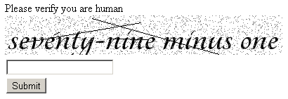

### Example for `ZnZend\Captcha\Question` Captcha Adapter

```php
// Form
<?php
namespace Web\Form;

use Zend\Form\Element;
use ZnZend\Captcha\Question;
use ZnZend\Captcha\Service\MathQuestionService;
use ZnZend\Form\Form;

class TestForm extends Form
{
    public function init()
    {
        $adapter = new Question(array(
            'service' => new MathQuestionService(),
            'font' => '/fonts/Tangerine_Bold.ttf',
            'fontSize' => 50,
            'transformImage' => false,
        ));
        $this->add(array(
            'name' => 'captcha',
            'type' => 'Zend\Form\Element\Captcha',
            'attributes' => array(
                'required' => true,
            ),
            'options' => array(
                'label' => 'Please verify you are human',
                'captcha' => $adapter,
                'separator' => '<br />', // this will add <br /> between image and input when rendering
            ),
        ));

        $element = new Element\Submit('submit');
        $element->setValue('Submit');
        $this->add($element);
    }
}
?>
```

```php
<!-- In view script -->
<?php
$form->prepare();
echo $this->form()->openTag($form);
echo $this->formRow($form->get('token')); // ZnZend\Form\Form adds a CSRF token by default

$element = $form->get('captcha');
echo $this->formLabel($element) . '<br />';
echo $this->formElement($element) . '<br />';
echo $this->formElementErrors($element);

echo $this->formRow($form->get('submit'));
echo $this->form()->closeTag();
?>
```

_BECOMES_


